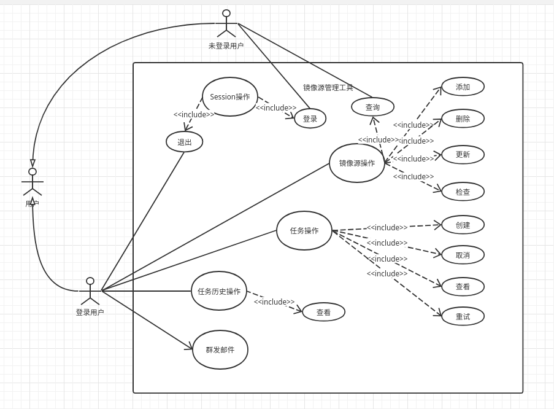
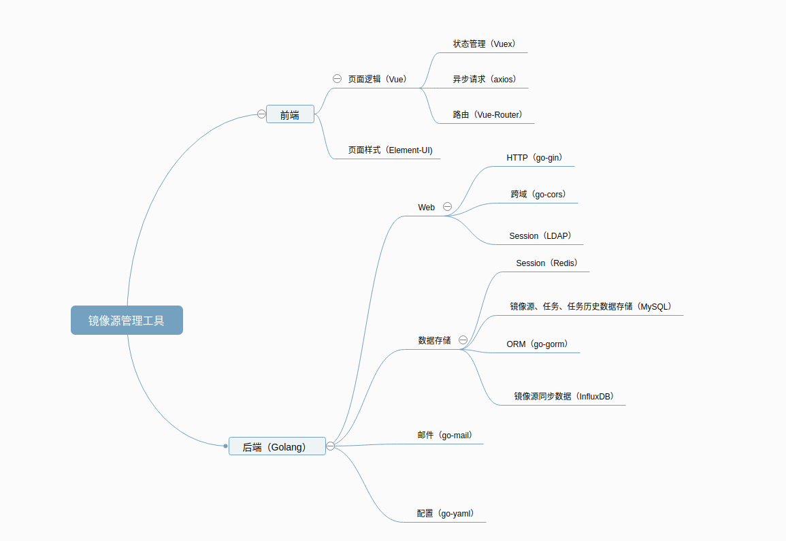

## 镜像源管理工具

### 项目概要设计

> 用例图

镜像源管理工具 用例图

> 技术图谱

镜像源管理工具 技术脑图

> 后台模块

- session
    项目利用LDAP进行系统的登录，并且根据用户登录状态的不同划分数据获取的权限，未登录的用户只包含镜像源列表获取和登录接口的访问。用户登录生成的Session ID保存在Redis中并设置有过期时间，超过相应的时间会导致Session失效，而前端每次请求都会携带相应的Session ID作为Cookie，后端通过对比传入的Session ID和Redis中保存的相应的数据确定用户是否处于登录状态。

- 镜像
    镜像源管理是本项目的核心，除了镜像站的CRUD功能之外，还包括镜像源同步进度检查及获取。镜像源的信息存储在MySQL中，而镜像源（包含CDN）的同步进度信息保存在InfluxDB中，每次对镜像源进度进行检查都会将最新的同步进度更新到数据库中，而每次进行查询时获取的都是最新的数据。镜像源的获取进行了分页，前端进行数据查询时加上特定的查询参数（page及limit）即可获取到分页的数据，相同的分页方法同样运用在了任务历史的分页中。

- 任务
    任务管理是本项目的重点，保证任务能够正常创建及删除，此外，还能对任务状态进行更新并获取。任务根据所选上游进行创建，而任务信息通过配置文件进行读取，文件中包含了一些CI任务的信息，通过后端触发相应任务并不断进行状态的获取并更新数据库任务状态信息。任务的逻辑说明如下：
    > 任务功能逻辑说明
    1. 创建任务，任务中包含一个到多个CI任务（可取消）
    2. 进行CI任务并在后端循环查询CI任务状态，若CI任务失败须通知任务创建者并暂停任务（可重试）
    3. CI任务成功后须在一段时间间隔后进行任务所在上游的镜像站的进度检查
    4. 镜像检查阶段若上游包含的镜像的同步进度未达到100%，则镜像检查任务失败，并暂停任务（可重试）
    5. 镜像检查完成后进行所在任务下一阶段的CI任务，跳至步骤2并循环至所有CI任务完成及镜像同步完成
    6. 任务状态确定后（“成功”或“取消”），建立任务的快照，快照中包含此时上游中包含的镜像站的同步进度
    
    > 发布任务逻辑说明
    1. 创建发布任务，即触发一个CI任务
    2. 该CI任务调用调用本项目后端的相应接口根据上游获取镜像源列表并对包含的镜像站进行发布
    3. 发布任务确定后（“成功”或“取消”），建立发布任务的快照

- 历史
    历史模块包含的是任务的历史，其中包含了对任务历史信息的记录，任务进行到一个特定的状态（”取消“或”成功“）都会生成相应的任务历史，且分页的任务历史信息可以通过相应接口获取。任务历史中包括了每个CI任务和镜像检查任务的快照。

> 前端模块

- session
    前端项目利用Vuex进行登录状态的全局保存，并通过相应的标志位进行一些页面的选择性展示和功能的提供，未登录的用户仅能查看镜像源列表以及登录接口。

- 镜像
    镜像组件可用于镜像源的CRUD操作以及镜像源的批量检查功能按钮，镜像列表组件可复用于任务历史中对镜像快照的分页展示。镜像展示页面的项目数写在了前端的配置文件中。

- 任务
    任务组件中包含了任务的创建和删除以及重试操作，并对任务状态进行了相应的展示，在任务的不同阶段提供了不同的功能按钮（例如，当任务中包含的某一CI任务失败时显示“重试”按钮）。

- 历史
    任务历史组件包含了对任务历史快照信息的展示，并且提供查看任务镜像同步进度快照的链接。

### 后端

> 已实现功能
- session管理，以LDAP账号登录状态的不同划分数据获取的权限
- 镜像源的CRUD操作
- 镜像源及其同步进度（和CDN进度）的获取
- 镜像站同步进度检查
- 任务的创建和删除
- 正在进行任务的状态更新和获取
- 任务各阶段生成任务快照及当时镜像状态的快照
- 任务失败时邮件通知任务创建者
- 任务执行失败后可保留任务状态并可重试
- 任务历史的获取
- 镜像源列表和任务历史的分页功能
- 群发邮件

> 未实现功能
- 发布功能
- 镜像源上次同步时间的记录及展示
- CI任务的取消
- jenkins配置可更改
- 管理员的操作日志，包括镜像源的CRUD，以及任务的创建删除及取消

> 接口及描述

1. session部分

| HTTP Method | Path     | Comment          |
| :---------- | -------- | :--------------- |
| POST        | /session | 游客登录         |
| DELETE      | /session | 管理员退出登录   |
| GET         | /session | 获取用户登录状态 |

2. 业务逻辑部分

| HTTP Method | Path                     | Comment                    |
| ----------- | ------------------------ | -------------------------- |
| POST        | /admin/mirrors           | 添加镜像                   |
| DELETE      | /admin/mirrors/:id       | 删除单个镜像               |
| PUT         | /admin/mirrors/:id       | 修改镜像信息               |
| GET         | /mirrors                 | 获取镜像               |
| GET         | /upstreams               | 获取所有镜像上游           |
| POST        | /admin/publish/:upstream | 发布上游                   |
| POST        | /admin/tasks             | 创建任务                   |
| DELETE      | /admin/tasks/:id         | 取消任务                   |
| GET         | /admin/tasks             | 获取所有正在进行的任务     |
| GET         | /admin/tasks/:id         | 获取单个任务信息           |
| PATCH       | /admin/tasks/:id         | 更改任务状态（完成或取消） |
| GET         | /admin/archives          | 获取任务历史      |
| POST        | /admin/mail | 手动发送邮件 |

### 前端

> 功能点
- 用户通过LDAP账号登录及退出
- 镜像源的增删改查
- 镜像源的分页列表展示
- 镜像源及其CDN的同步进度展示
- 镜像源的批量检查
- 页面群发邮件至镜像源维护者
- 新建任务
- 正在进行中的任务详情展示
- 任务历史快照分页展示

### 已知Bugs

1. 前端页面的任务描述“镜像同步”应改为“镜像检查”
2. 未完成的任务不应该有历史快照
3. CI任务的状态表示不够完善，应包含“未开始”，“进行中”，“失败”，“成功”，“取消”
4. 分页功能待优化，可利用后端返回的header中的相应字段进行分页查询
5. 任务中镜像检查失败可以在一段时间后重试直至成功